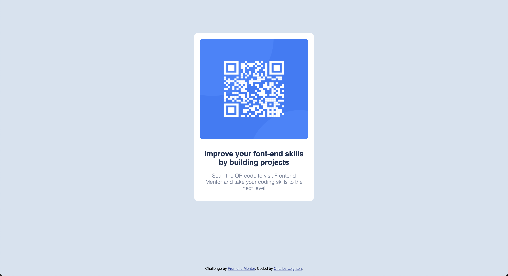

# Frontend Mentor - QR code component solution

This is a solution to the [QR code component challenge on Frontend Mentor](https://www.frontendmentor.io/challenges/qr-code-component-iux_sIO_H). Frontend Mentor challenges help you improve your coding skills by building realistic projects.

## Table of contents

- [Overview](#overview)
  - [Screenshot](#screenshot)
  - [Links](#links)
- [My process](#my-process)
  - [Built with](#built-with)
  - [What I learned](#what-i-learned)
  - [Continued development](#continued-development)
- [Author](#author)

## Overview

### Screenshot

### Links

- Solution URL: [Link](https://github.com/chleighton1/qr-code-component-main)
- Live Site URL: [Link](https://chleighton1.github.io/qr-code-component-main/)

## My process

### Built with

- Semantic HTML5 markup
- CSS custom properties
- Flexbox

### What I learned

This was a pretty simple project but good practice to re-enforce my knowledge of flex and mobile design.

### Continued development

I am going to start developing projects using a framework such as Next.js rather than just HTML and CSS

## Author

- Website - [Charles Leighton](https://www.chleighton.live/)
- Frontend Mentor - [@chleighton1](https://www.frontendmentor.io/profile/chleighton1)
